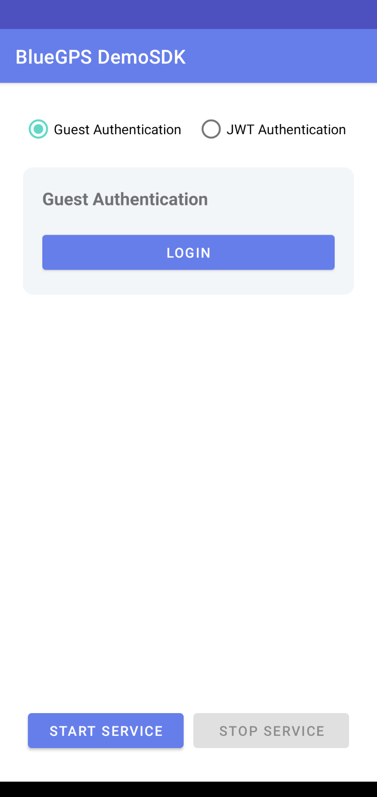
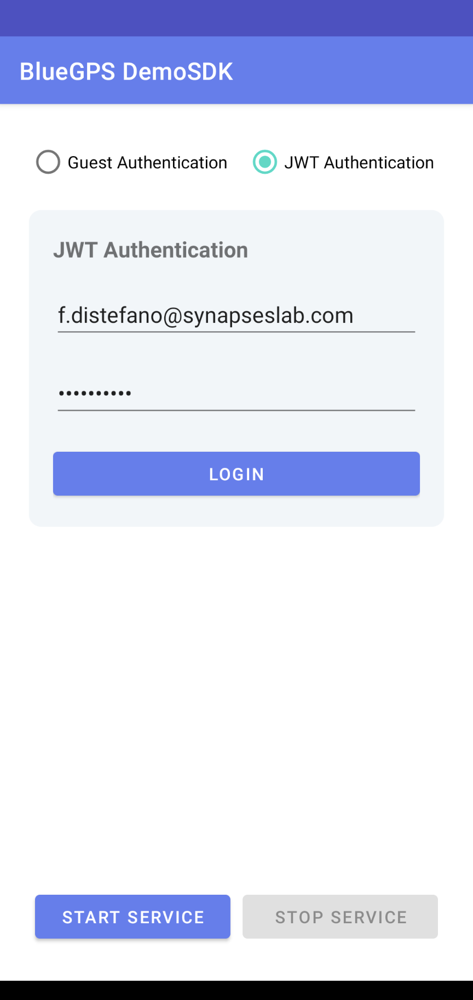
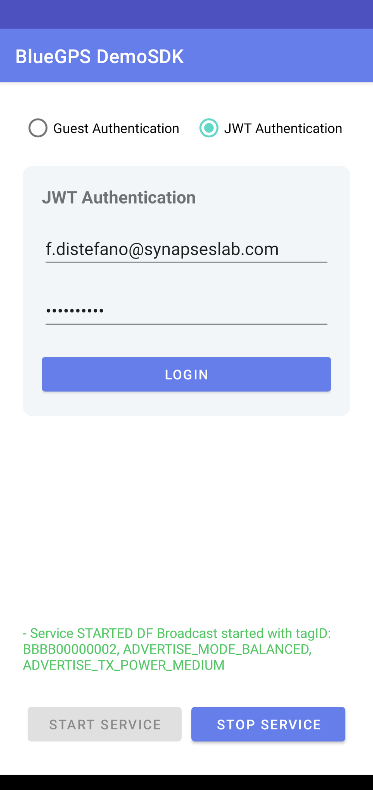
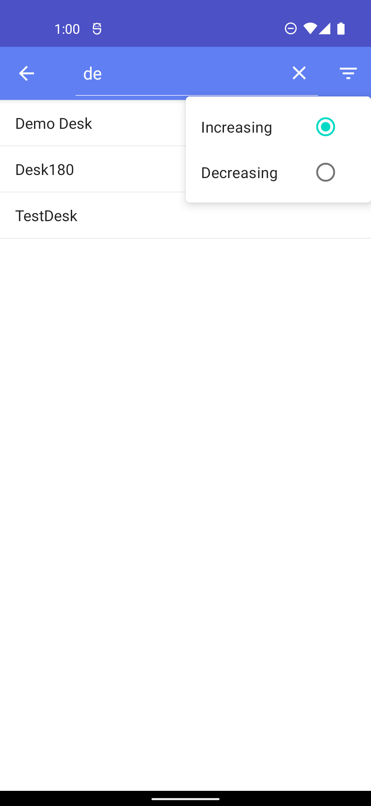

BlueGPS Android SDK
==

<!-- TOC -->

- [1. Introduction](#1-introduction)
- [2. Integration guide](#2-integration-guide)
    - [2.1. Requirements](#21-requirements)
    - [2.2. Adding the Library to an existing Android application](#22-adding-the-library-to-an-existing-android-application)
- [3. Usage guide](#3-usage-guide)
- [4. Use BlueGPS Advertising Service](#4-use-bluegps-advertising-service)
    - [4.1. Optional](#41-optional)
- [5 BlueGPSMapView](#5-bluegpsmapview)
    - [5.1 ToolboxGUI](#51-toolboxgui)
    - [5.2 Map Listener](#52-map-listener)
    - [5.3 Map Interactions](#53-map-interactions)
      - [5.3.1 resetView](#531-resetview)
      - [5.3.2 rotate](#532-rotate)
      - [5.3.3 rotateAbsolute](#533-rotateabsolute)
      - [5.3.4 hideRoomLayer](#534-hideroomlayer)
      - [5.3.5 nextFloor](#535-nextfloor)
      - [5.3.6 showTag](#536-showtag)
      - [5.3.7 getFloor](#537-getfloor)
      - [5.3.8 gotoFloor](#538-gotofloor)
      - [5.3.9 gotoFromMe](#539-gotofromme)
      - [5.3.10 goto](#5310-goto)
      - [5.3.11 getMapStyle](#5311-getmapstyle)
      - [5.3.12 setMapStyle](#5312-setmapstyle)
      - [5.3.13 setStartBookingDate](#5313-setstartbookingdate)
      - [5.3.14 setBookingDate](#5314-setbookingdate)
      - [5.3.15 reloadResource](#5315-reloadresource)
      - [5.3.16 removeNavigation](#5316-removenavigation)
      - [5.3.17 loadGenericResource](#5317-loadgenericresource)
      - [5.3.18 selectPoi](#5318-selectpoi)
      - [5.3.19 selectPoiById](#5319-selectpoibyid)
      - [5.3.20 drawPin](#5320-drawpin)
      - [5.3.21 getCurrentFloor](#5321-getcurrentfloor)
      - [5.3.22 centerToRoom](#5322-centertoroom)
      - [5.3.23 centerToPosition](#5323-centertoposition)
      - [5.3.24 initAllBookingLayerBy](#5324-initallbookinglayerby)
      - [5.3.25 setDarkMode](#5325-setdarkmode)   
- [6. Server Sent Events](#6-server-sent-events)
    - [6.1 Diagnostic SSE](#61-diagnostic-sse)
      - [Event `complete`](#event-complete)
      - [Event `tagTracking`](#event-tagtracking)
      - [Event `onCheck`](#event-oncheck)
      - [stopDiagnostic](#stopdiagnostic)
    - [6.2 Notify region changes](#62-notify-region-changes)
      - [6.2.1 Event `callbackHandler`](#621-event-callbackhandler)
      - [6.2.2 Stop notify region changes](#622-stop-notify-region-changes)
    - [6.3 Notify position changes](#63-notify-position-changes)
      - [6.3.1 Event `callbackHandler`](#631-event-callbackhandler)
      - [6.3.2 Stop notify position changes](#632-stop-notify-position-changes)
- [7. Resources API](#7-resources-api)
- [8. Search object API](#8-search-object-api)
  - [8.1 getTrackElement](#81-gettrackelement)
  - [8.2 getTrackElementTagHistory](#82-gettrackelementtaghistory)
  - [8.3 getTrackElements](#83-gettrackelements)
  - [8.4 getTrackElementPage](#84-gettrackelementpage)
  - [8.5 getTrackGroup](#85-gettrackgroup)
  - [8.6 getFilter](#86-getfilter)
  - [8.7 search](#87-search)
- [9. Controllable items API](#9-controllable-items-api)
- [10. Area API](#10-area-api)
  - [10.1 getRoomsCoordinates](#101-getroomscoordinates)
  - [10.2 getMapsList](#102-getmapslist)
  - [10.3 getAreasWithTagsInside](#103-getareaswithtagsinside)
  - [10.4 getAreasList](#104-getareaslist)
  - [10.5 getAreaListRealtimeElement](#105-getarealistrealtimeelement)
- [11. Booking API](#11-booking-api)
  - [11.1 getAgendaDay](#111-getagendaday)
  - [11.2 getAgendaMy](#112-getagendamy)
  - [11.3 agendaFind](#113-agendafind)
  - [11.4 schedule](#114-schedule)
- [12. OAuth client for keycloak authentication](#12-oauth-client-for-keycloak-authentication)
  - [12.1 Client Configuration](#121-client-configuration)


<!-- /TOC -->

<div style="page-break-after: always;"></div>

# 1. Introduction

This document holds a general guide for the integration of the BlueGPS SDK library into an Android
application. The BlueGPS SDK implements the communication with the BlueGPS server allowing Android
Applications to make use of the system.

*All the data contained in this document are currently under development and may be subject to
change.*


# 2. Integration guide

## 2.1. Requirements

Minimum requirements are:

- Minimum SDK: 21
- Usage of Android X

<div style="page-break-after: always;"></div>

## 2.2. Adding the Library to an existing Android application

Before you add BlueGPS depencencies, update your repositories in the `settings.gradle` file to include this repository

```gradle
dependencyResolutionManagement {
    repositoriesMode.set(RepositoriesMode.FAIL_ON_PROJECT_REPOS)
    repositories {
        google()
        mavenCentral()
        maven { url = uri("https://jitpack.io") }
    }
}
```

Or if you're using an older project setup, add this repository  in your project level `build.gradle` file:

```gradle
allprojects {
    repositories {
        google()
        mavenCentral()
        maven { url = uri("https://jitpack.io") }
    }
}
```

Then add the dependency for BlueGPS-SDK in the `build.gradle` file for your app or module:

```gradle
dependencies {
    implementation 'com.github.synapseslab:android-bluegps-sdk-demoapp:<version>'
}
```

The `version` corresponds to release version, for example:

```gradle
dependencies {
    implementation 'com.github.synapseslab:android-bluegps-sdk-demoapp:1.4.2-rc4'
}
```

<div style="page-break-after: always;"></div>

# 3. Usage guide

If doesn’t exists create an `Application` class and in `onCreate()` method call the `initSDK()`
method to initialize the BlueGPS SDK.

```kotlin
class DemoApplication : Application() {

    override fun onCreate() {
        super.onCreate()
        
        BlueGPSLib.instance.initSDK(
            sdkEnvironment = Environment.sdkEnvironment,
            context = this,
        )
    }

}
```

Then declare this `Application` class in your `AndroidManifest.xml`.

The SDK use an `Environment` where integrator have to put SDK data for register the SDK and for
create a communication with the BlueGPS Server (see the demo app for detail). The management of the
environment is demanded to the app.

Demo App provide with the SDK provide an Environment example like the following:

```kotlin
/**
 * Set the environment for register the SDK to the server.
 * The management of the environment is demanded to the app.
 *
 * SDK_ENDPOINT (mandatory)
 * APP_ID (mandatory)
 *
 */
object Environment {

    private val SDK_ENDPOINT = "{{provided-bluegps-endpoint}}"
    private val SDK_KEY = "{{provided-sdk-key}}"
    private val SDK_SECRET = "{{provided-sdk-secret}}"
    private val APP_ID = "com.synapseslab.demosdk"


    val sdkEnvironment = SdkEnvironment(
        sdkEndpoint = SDK_ENDPOINT,
        appId = APP_ID,
        sdkKey = SDK_KEY,
        sdkSecret = SDK_SECRET,
    )


    // TODO: For JWT Authentication, this credentials are for demo purpose.
    const val USERNAME = ""
    const val PASSWORD = ""

}
```

Demo application shows two authentication options:

- Guest Authentication
- JWT Authentication. The above authentication mechanisms are mutually exclusive.

<br />
<br />





<br />
<br />

After login app uses the `registerSDK()` method of the library to enable the SDK. The process will
run on background.

<br />

<div style="page-break-after: always;"></div>

# 4. Use BlueGPS Advertising Service

For use the BlueGPS Advertising service, defines callbacks for service binding, passed to `bindService()`

```kotlin
private val advertisingServiceConnection = object : ServiceConnection {

    override fun onServiceConnected(name: ComponentName, service: IBinder) {
        val binder = service as BlueGPSAdvertisingService.LocalBinder
        blueGPSAdvertisingService = binder.serviceBlueGPS
    }

    override fun onServiceDisconnected(name: ComponentName) {
        blueGPSAdvertisingService = null
    }
}
```

Bind to BlueGPSAdvertisingService onStart method:

```kotlin
override fun onStart() {
    super.onStart()

    val serviceIntent = Intent(this, BlueGPSAdvertisingService::class.java)
    bindService(
        serviceIntent,
        advertisingServiceConnection,
        Context.BIND_AUTO_CREATE
    )
}
```

Clients should unbind from services at appropriate times

```kotlin
override fun onStop() {
    super.onStop()
    unbindService(advertisingServiceConnection)
}
```

For start the advertising call:

```kotlin
blueGPSAdvertisingService?.startAdv()
```

or 

```kotlin
blueGPSAdvertisingService?.startAdv(androidAdvConfiguration = androidAdvConfiguration!!)
```

where `androidAdvConfiguration` a device configuration for advertising as follow:

```kotlin
data class AndroidAdvConfiguration(
    var tagid: String? = null,
    var advModes: String? = null,
    var advTxPowers: String? = null
)
```

For obtain a device configuration for advertising call this function:

```kotlin
suspend fun getDeviceConfiguration(): Resource<AndroidAdvConfiguration>
```

For stop you service advertising call:

```kotlin
blueGPSAdvertisingService?.stopAdv()
```

<br />
<br />



<br />
<br />

## 4.1. Optional

If you are interested to receiver logs and display info about the status of the Service,
subclass ``BroadcastReceiver`` and implement the ``onReceive(...)`` method.

The status of the service are: ``STARTED``, ``STOPPED``, ``ERROR``.

```kotlin
private val advertisingServiceReceiver = object : BroadcastReceiver() {
        override fun onReceive(context: Context, intent: Intent) {
            if (intent.action == BlueGPSAdvertisingService.ACTION_ADV) {
                intent.getParcelableExtra<AdvertisingStatus>(BlueGPSAdvertisingService.DATA_ADV)?.let {

                    Log.d(TAG, "- Service ${it.status} ${it.message}")
                }
            }
        }
    }
```

then register the receiver in ``onResume()`` method and unregister the receiver in ``onPause()``
method.

Show the demo example for more details.

## 5 BlueGPSMapView

BlueGPS comes with an handy object to deal with Maps named `BlueGPSMapview`. To use the object you
can import the component in your xml layout or programmatically inflate it.

```xml

<com.synapseslab.bluegps_sdk.component.map.BlueGPSMapView 
    android:id="@+id/webView"
    android:layout_width="match_parent" 
    android:layout_height="match_parent"
    app:layout_constraintBottom_toBottomOf="parent" 
    app:layout_constraintEnd_toEndOf="parent"
    app:layout_constraintStart_toStartOf="parent" 
    app:layout_constraintTop_toTopOf="parent" />

```

Before can be used, `BlueGPSMapView` should be initialized. Otherwise you will see a loading
animation like below:


In order to configure properly the object you need call the `initMap()`

```kotlin
fun initMap(
    sdkEnvironment: SdkEnvironment,
    configurationMap: ConfigurationMap? = ConfigurationMap()
) { 
    ....
}
````

with this parameters:

1. `sdkEnvironment` for authenticate the map;
2. `configurationMap` to config your map, the map start with a default configuration;

```kotlin
private var configurationMap = ConfigurationMap(
    tagid = "CFFF00000001",
    style = MapStyle(
        icons = IconStyle(
            name = "chorus",
            align = "center",
            vAlign = "bottom",
            followZoom = true
        ),
        
        navigation = NavigationStyle(
            iconSource = "/api/public/resource/icons/commons/start.svg",
            iconDestination = "/api/public/resource/icons/commons/end.svg",
            
            // dictionary of target velocity calculation, the velocity is expressed in km/h
            velocityOptions = mutableMapOf("foot" to 4.0, "bike" to 10.0),
            
            // unit in meters to divide the navigation in steps
            navigationStep = 1.5,
            
            // enable or disable autoZoom capability when in navigation mode
            autoZoom = true,
            
            // debug capability to see the steps when in navigation mode
            showVoronoy = false
        )
    ),
    show = ShowMap(all = true, room = true),
)
```

At this point the configuration is injected and the loading animation should disappear and replaced
by your map:


## 5.1 ToolboxGUI

The demo app show a Toolbox GUI for configure behaviours and visual components displayed on the map.

Once modified, the new model could be injected into the current configuration. This demo shows only
some of the functions to be able to interact with the map control bar to enable or disable it,
change orientation, change the size of the buttons.


## 5.2 Map Listener

BlueGPSMapView could trigger your app remotely from the server. To handle an event click on the map,
it's necessary setup the listener.

```kotlin
private fun setListenerOnMapView() {
    binding.webView.setBlueGPSMapListener(object : BlueGPSMapListener {
        override fun resolvePromise(data: JavascriptCallback, typeMapCallback: TypeMapCallback) {
            /**
                * Callback that intercept the click on the map
                *
                * @param data the clicked point with all info.
                * @param typeMapCallback the type of the clicked point.
                *
                */
                when (typeMapCallback) {
                    
                    TypeMapCallback.INIT_SDK_COMPLETED -> { }   
                    TypeMapCallback.PARK_CONF -> { }
                    TypeMapCallback.MAP_CLICK, TypeMapCallback.TAG_CLICK -> { 
                        val cType = object : TypeToken<Position>() {}.type
                        val payloadResponse = Gson().fromJson<Position>(data.payload, cType)
                        
                        if (payloadResponse.roomId != null) {
                            // is a room
                        } else if (payloadResponse.tagid != null) {
                            // is a tag
                        }
                    }
                    TypeMapCallback.BOOKING_CLICK -> {
                        val cType = object : TypeToken<ClickedObject>() {}.type
                        val payloadResponse = Gson().fromJson<ClickedObject>(data.payload, cType)
                        Log.d(TAG, " $TAG $payloadResponse ") 
                    }
                    TypeMapCallback.NAV_STATS -> {
                        val cType = object : TypeToken<NavigationStats>() {}.type
                        val payloadResponse = Gson().fromJson<NavigationStats>(data.payload, cType)
                        Log.d(TAG, " $TAG $payloadResponse ")
                    }
                    TypeMapCallback.NAV_INFO -> {
                        val cType = object : TypeToken<NavInfo>() {}.type
                        val payloadResponse = Gson().fromJson<NavInfo>(data.payload, cType)
                        Toast.makeText(context, "${payloadResponse.message}", Toast.LENGTH_LONG).show()
                    }
                    TypeMapCallback.RESORUCE -> {
                        val cType = object : TypeToken<DataFilter>() {}.type
                        val payloadResponse = Gson().fromJson<DataFilter>(data.payload, cType)
                        Log.d(TAG, " $TAG $payloadResponse ")
                    }
                    TypeMapCallback.TAG_VISIBILITY -> {
                        val cType = object : TypeToken<TagVisibility>() {}.type
                        val payloadResponse = Gson().fromJson<TagVisibility>(data.payload, cType)
                        Log.d(TAG, " $TAG $payloadResponse ")
                    }
                    TypeMapCallback.ROOM_ENTER -> {
                        val cType = object : TypeToken<Position>() {}.type
                        val payloadResponse = Gson().fromJson<Position>(data.payload, cType)
                        Log.d(TAG, " $TAG $payloadResponse ")
                    }
                    TypeMapCallback.ROOM_EXIT -> {
                        val cType = object : TypeToken<Position>() {}.type
                        val payloadResponse = Gson().fromJson<Position>(data.payload, cType)
                        Log.d(TAG, " $TAG $payloadResponse ")
                    }
                    TypeMapCallback.FLOOR_CHANGE -> {
                        val cType = object : TypeToken<Floor>() {}.type
                        val payloadResponse = Gson().fromJson<Floor>(data.payload, cType)
                        Log.d(TAG, " $TAG $payloadResponse ")
                    }
                    TypeMapCallback.SUCCESS -> {
                        val cType = object : TypeToken<GenericInfo>() {}.type
                        val payloadResponse = Gson().fromJson<GenericInfo>(data.payload, cType)
                        payloadResponse.key = data.key
                        Log.d(TAG, " ${payloadResponse.message} ")
                    }
                    TypeMapCallback.ERROR -> {
                        val cType = object : TypeToken<GenericInfo>() {}.type
                        val payloadResponse = Gson().fromJson<GenericInfo>(data.payload, cType)
                        payloadResponse.key = data.key
                        Log.e(TAG, " ${payloadResponse.message} ")
                    }
            }
        }
    })
}
```

Once implemented, you can easily test receiving remote events by tapping on a room, or a tag in your
app.

The `resolvePromise(::)` method should be triggered appropriately.

List of the callbacks:
- `TypeMapCallback.INIT_SDK_COMPLETED` triggered when init sdk is completed.
- `TypeMapCallback.PARK_CONF` triggered if show.park is enabled.
- `TypeMapCallback.BOOKING_CLICK` triggered if a bookable resource is clicked.
- `TypeMapCallback.NAV_STATS` triggered on any navigation update.
- `TypeMapCallback.NAV_INFO` triggered on navigation mode when tag is proximity to specific. points. 
- `TypeMapCallback.RESORUCE` triggered when loadGenericResource is called.
- `TypeMapCallback.TAG_VISIBILITY` triggered if ConfigurationMap.tagid is present and the tag change its visibility status.
- `TypeMapCallback.ROOM_ENTER` triggered when user enter a room.
- `TypeMapCallback.ROOM_EXIT` triggered when user exit a room.
- `TypeMapCallback.FLOOR_CHANGE` triggered when the user change floor.
- `TypeMapCallback.SUCCESS` triggered when a generic async action end with success.
- `TypeMapCallback.ERROR` triggered when a generic async action end with error.

## 5.3 Map Interactions

BlueGPSMapView support multiple interactions that could be triggered programmatically from the code.

### 5.3.1 resetView

```kotlin
mapView.resetView()
```

This action resize the map to the startup. The action is present on the map toolbox.

### 5.3.2 rotate

```kotlin
mapView.rotate(step: Int)
```

This action rotate the map by adding step to current location. `step` represent the incremental
number of degree to rotate the map.

### 5.3.3 rotateAbsolute

```kotlin
mapView.rotateAbsolute(angle: Int)
```

his action set the angle rotation of the map according to the parameter. `angle` represent the
absolute number of degree to rotate the map.

### 5.3.4 hideRoomLayer

```kotlin
mapView.hideRoomLayer(hide: Boolean)
```

This action allow to show or hide the room layer. `hide` if true hide the layer, false otherwise.

### 5.3.5 nextFloor

```kotlin
mapView.nextFloor()
```

This action allow to load the next floor on the web view.

### 5.3.6 showTag

```kotlin
mapView.showTag(tagid: String, follow: Boolean)
```

This action find the tag with the specified tagid and if found switch to the right floor and follow
the tag if `follow` is true.

### 5.3.7 getFloor

```kotlin
mapView.getFloor() { result, error ->
    error?.let {
        Log.e(TAG, "$error")
    } ?: run {
        MaterialAlertDialogBuilder(this@MapActivity)
            .setTitle("Floor list")
            .setMessage(result.toString())
            .setPositiveButton("Ok") { dialog, _ ->
                dialog.dismiss()
            }
            .show()
    }
}
```

Return the list of floors, in the form of [Floor].

### 5.3.8 gotoFloor

```kotlin
mapView.gotoFloor(floor: Floor)
```

Move the map to the specified Floor.

### 5.3.9 gotoFromMe

```kotlin
mapView.gotoFromMe(
    position: Position, 
    navigationMode: Boolean = false)
```

This function enable path drawing for a specific destination. The path drawing will from the user
position to the selected destination position.

`navigationMode`: if true, draw the path in navigation mode.

### 5.3.10 goto

```kotlin
mapView.goto(
    source: Position, 
    dest: Position, 
    navigationMode: Boolean = false)
```

This function enable path drawing for a specific destination. The path drawing will from the source
position to the selected destination position.

`navigationMode`: if true, draw the path in navigation mode.

### 5.3.11 getMapStyle

```kotlin
mapView.getMapStyle() {result, error ->
    error?.let {
        Log.e(TAG, "$error")
    } ?: run {
        Log.d(TAG, "$result")
    }
}
```

This function get the actual style configuration.

### 5.3.12 setMapStyle

```kotlin
mapView.setMapStyle(style: MapStyle)
```

`style`: represent the map style object

This function allow to change the map style, the function overwrite only the attribute present.

### 5.3.13 setStartBookingDate

```kotlin
mapView.setStartBookingDate(date: String? = today)
```

`date`: BASIC_ISO string in format yyyy-MM-dd (ex. 2021-08-30), if not present dafault is today.

This function allow to set the start of booking selection, by default is today.

### 5.3.14 setBookingDate

```kotlin
mapView.setBookingDate(date: String)
```

`date`: BASIC_ISO string in format yyyy-MM-dd (ex. 2021-08-30).

This function allow to set the booking selection.

### 5.3.15 reloadResource

```kotlin
mapView.reloadResource(date: String)
```

`date`: BASIC_ISO string in format yyyy-MM-dd (ex. 2021-08-30).

This function reload the map view.

### 5.3.16 removeNavigation

```kotlin
mapView.removeNavigation()
```

This function exit from navigation and remove path either on navigation mode or not.

### 5.3.17 loadGenericResource

```kotlin
mapView.loadGenericResource(search: String? = "", type: String? = "", sybtype: String? = "")
```

- `search`: the resource name
- `type`: of the resource
- `subtype` of the resource

This function load only resource that match the criteria passed by parameters.

### 5.3.18 selectPoi

```kotlin
mapView.selectPoi(poi: GenericResource, changeFloor: Boolean? = true)
```

- `poi`: generic resource
- `changeFloor`: optional parameter with default value to true

Center the map to the poi passed as parameter.

### 5.3.19 selectPoiById

```kotlin
mapView.selectPoiById(poiId: Int, changeFloor: Boolean? = true)
```

- `poiId`: id of the poi
- `changeFloor`: optional parameter with default value to true

Center the map to the poi identified by poiId.

### 5.3.20 drawPin

```kotlin
mapView.drawPin(position: Position, icon: String? = "")
```

- `position`: object position
- `icon`: a String the represent absolute or relative path to the icon.

Draw a pin in the passed position. The pin has the icon passed as parameter.

### 5.3.21 getCurrentFloor

```kotlin
mapView.getCurrentFloor()
```

Return the current floor.

### 5.3.22 centerToRoom

```kotlin
mapView.centerToRoom(roomId: Int)
```

`roomId` the id of the room

Center the map to the room identified by roomId.

### 5.3.23 centerToPosition

```kotlin
mapView.centerToPosition(mapPosition: Position, zoom: Double)
```

- `mapPosition` the object position
- `zoom` the zoom level. The range is a double [0.7, 10]

Center the map to the specified position.

### 5.3.24 initAllBookingLayerBy

```kotlin
mapView.initAllBookingLayerBy(bookFilter: BookFilter)
```

- `bookFilter` a book filter

Init on map all booking layer like: Desk, Park, Meeting.

### 5.3.25 setDarkMode

```kotlin
mapView.setDarkMode(darkMode: Boolean)
```

- `darkMode` a boolean

To change the style of the map darkMode or lightMode


<div style="page-break-after: always;"></div>

# 6. Server Sent Events

The purpose of diagnostic API is to give an indication to the integrator of the status of the
BlueGPS system.

The diagnostic is designed to include different info like:

- Tag tracking status
- Connector tracking status like:
    - DesigoCC
    - Micronpass
    - Quuppa

## 6.1 Diagnostic SSE

For diagnostic if a tag is `ACTIVE` or `NOT_ACTIVE`, `BlueGPSLib` expose a specific call `startDiagnostic(..)` where:
- `diagnosticSseRequest` is a list of tags; 
- `onComplete` callback; 
- and optional `onTagTracking` and `onCheck` callbacks.

```kotlin
val diagnosticSseRequest = DiagnosticSseRequest(
    TrackingSseRequest(tags = listOf("BBBB00000001", "BBBB00000002"))
)

BlueGPSLib.instance.startDiagnostic(
    diagnosticSseRequest = diagnosticSseRequest,
    onComplete = {
        // is a DiagnosticSseResponse
        Log.d(TAG, "COMPLETE: $it")
    },
    onTagTracking = {
        // is a Map<String, DiagnosticStatus>?
        Log.d(TAG, "TAG_TRACKING: $it")
    },
    onCheck = {
        // is a String
        Log.d(TAG, "CHECK: $it")
    }
)
``` 

`diagnosticSseRequest` is an object so structured:

```kotlin
class DiagnosticSseRequest(
    val tagTracking: TrackingSseRequest? = null
)

class TrackingSseRequest(
    val forgetTagMillis: Long? = 10000,
    val tags: List<String>? = null,
)
```

where

- `forgetTagMillis` is default to 10 seconds;
- `tags` is a list of tags you want to monitoring.

There are 2 types of events:

### Event `complete`

This event is returned as the first event and `DiagnosticSseResponse` object has the following format:

```
    data: {"tracking":{"tags":{"BBBB00000001":"NOT_ACTIVE"}}}
    name: "complete"
```

### Event `tagTracking`

This event is returned when there is an update on list of tags:

```
    data: {"BBBB00000001":"ACTIVE"}
    name: "tagTracking"
```

The `data` response is a `Map<String, DiagnosticStatus>`.

### Event `onCheck`

This event is a check that notifies that the diagnostic is alive.

### stopDiagnostic

`BlueGPSLib` expose an accessory method for deactivate the diagnostic.

```kotlin
BlueGPSLib.instance.stopDiagnostic()
```

<br />

> If during the life of the app it's necessary change the configuration it will be enough to call `startDiagnostic(..)`
because this method stop a previously job active and start the diagnostic with the new configuration. 

<br />

For more info check the example app in `SseDiagnosticTagActivity.kt` class.

<br />

## 6.2 Notify region changes

For activate the position event detection when the user move inside building,
`BlueGPSLib` expose a specific call `startNotifyRegionChanges(..)` where the params of this function are:
- `regions` represents the list of the regions to monitor;
- and a `callbackHandler` callback.

```kotlin
BlueGPSLib.instance.startNotifyRegionChanges(
    regions = regions,
    callbackHandler = {
        val status = if(it.isInside) "Entered in:" else "Exit from:"
        Log.d(TAG, "$status ${it.name}")
    }
)
```

### 6.2.1 Event `callbackHandler`

This callback return a value when an event occurred. The object returned `BGPRegion` has this structure:

```kotlin
data class BGPRegion(
    val id: Int? = null,
    val name: String? = null,
    val buildingFloorId: Int? = null,
    val buildingFloorName: String? = null,
    val px: Double? = null,
    val py: Double? = null,
    val showOnApp: Boolean? = null,
    val searchable: Boolean? = null,
    val status: BGPRegionStatus? = null,
    val type: String? = null,
    val areaId: Int? = null,
    val areaName: String? = null,
    val area: BGPArea? = null,
    var isInside: Boolean = false,
)
```

When the `BGPRegion` returned has is `isInside` attribute set to `true` the tag is entered in the region.

Otherwise when the `BGPRegion` returned has is `isInside` attribute set to `false` the tag is exit from the region.

> **Attention:** 

Before call `startNotifyRegionChanges()` it's necessary to call

```kotlin
blueGPSAdvertisingService?.startAdv()
``` 

or

```kotlin
blueGPSAdvertisingService?.startAdv(androidAdvConfiguration = androidAdvConfiguration!!)
```

because when advertising service is started a `tagID` is assigned to the app.


### 6.2.2 Stop notify region changes

`BlueGPSLib` expose an accessory method for deactivate the Notify region job.

```kotlin
BlueGPSLib.instance.stopNotifyRegionChanges()
```

<br />

> If during the life of the app it's necessary change the configuration it will be enough to re-call `startNotifyRegionChanges(..)`
because this method stop a previously job active and start the event detection with the new configuration.

<br />

For more info check the example app in `NotifyRegionActivity.kt` class.

<br />

## 6.3 Notify position changes

For activate the position event detection when the user move inside building,
`BlueGPSLib` expose a specific call `startNotifyPositionChanges()` where the params of this function are:
- and a `callbackHandler` callback.

```kotlin
BlueGPSLib.instance.startNotifyPositionChanges(
    callbackHandler = {
        Log.d(TAG, "$position ${it}")
    }
)
```

### 6.3.1 Event `callbackHandler`

This callback return a value when an event occurred. The object returned `Position` has this structure:

```kotlin
data class Position(
    var mapId: Int? = null,
    var tagid: String? = null,
    var roomId: Int? = null,
    var areaId: Int? = null,
    var x: Double? = null,
    var y: Double? = null,
    var data: String? = null,
    var tagLabel: String? = null,
)
```


### 6.3.2 Stop notify position changes

`BlueGPSLib` expose an accessory method for deactivate the Notify position job.

```kotlin
BlueGPSLib.instance.stopNotifyPositionChanges()
```

<br />

> If during the life of the app it's necessary change the configuration it will be enough to re-call `startNotifyPositionChanges(..)`
because this method stop a previously job active and start the event detection with the new configuration.

<br />

For more info check the example app in `NotifyPositionActivity.kt` class.

<div style="page-break-after: always;"></div>


## 7 Resources API

The BlueGPSLib perform a network call to find a list of resources. 

```kotlin
    override suspend fun findResources(
        isDesc: Boolean?,
        mapId: Int?,
        order: String?,
        search: String?,
        subType: String?,
        type: String?,
        roomId: Int?,
        roomName: String?
    ): Resource<List<GenericResource>?>
```

where

- `isDesc` a boolean that represent if is increasing or decreasing
- `mapId` the id of the map where the resource is located
- `order` 
- `search` the name of the resource
- `subType`
- `type` the resource type (`PARK`, `DESK`, `MEETING`)
- `roomId` the id of the room where the resource is located
- `roomName` the name of the room where the resource is located

It's present an example activity called `ShowResourcesActivity.kt` that show the utility and the use of this network call.



<div style="page-break-after: always;"></div>

## 8 Search object API

BlueGPSSDK provides some built-in capabilities to search for resources and objects within the Backend, providing multiple calls:

### 8.1 getTrackElement

**getTrackElement** returns a tracked element by passing a corresponding **ID**.

```kotlin
suspend fun getTrackElement(trackElementId)
```

The resulting **ResponseMessage** contains a `TrackedElement` as follow:

```kotlin
data class TrackedElement(
    var id: Int?,
    var label: String?,
    var type: String?,
    var description: String?,
    var imgPath: String?,
    var color: String?,
    var trackElementType: TrackElementType?,
    var groups: List<TrackedGroup>?,
    var trackAreaId: Int?,
    var positionItem: PositionItem?,
    var tagList: List<TrackElementTag>?,
)
```

### 8.2 getTrackElementTagHistory

**getTrackElementTagHistory** returns a tag history passing a corresponding **ID**.

```kotlin
suspend fun getTrackElementTagHistory(trackElementId: Int)
```

The resulting **ResponseMessage** contains a list of `List<TrackElementTag>` as follow:

```kotlin
data class TrackElementTag(
    var id: Int?,
    var insertDate: String?,
    var readOnly: Boolean = true,
    var end: String?,
    var start: String?,
    var priority: Int?,
    var trackElementId: Int?,
    var trackElementLabel: String?,
    var trackTagId: String?,
    var trackTagLabel: String?,
)
```

### 8.3 getTrackElements

**getTrackElements** return an array of `TrackElement` based on the filter criteria specified.

```kotlin
suspend fun getTrackElements(
    type: String? = null,
    groupIds: List<Int>? = null,
    search: String? = null,
    isDesc: Boolean? = null,
    order: String? = null,
)
```

where:

- `search` is the name of the track element
- `type` 
- `groupIds` a list of id that represent the group
- `isDesc` a boolean that represent if is increasing or decreasing
- `order` a string that represent the order by a attribute
- `pageNumber` an that represent the current page
- `pageSize` the elements of the page

The resulting **ResponseMessage** contains a `List<TrackElement>` as follow:

```kotlin
data class TrackElement(
    var id: Int? = null,
    var label: String? = null,
    var type: String? = null,
    var description: String? = null,
    var imgPath: String? = null,
    var email: String? = null,
    var color: String? = null,
    var trackElementType: TrackElementType? = null,
    var groups: List<TrackedGroup>? = null,
    var positionItem: PositionItem? = null
)
```


### 8.4 getTrackElementPage

**getTrackElementPage** return a track element page based on the filter criteria specified.

```kotlin
suspend fun getTrackElementPage(
    type: String? = null,
    groupIds: List<Int>? = null,
    search: String? = null,
    isDesc: Boolean? = null,
    order: String? = null,
)
```

where:

- `search` is the name of the track element
- `type` 
- `groupIds` a list of id that represent the group
- `isDesc` a boolean that represent if is increasing or decreasing
- `order` a string that represent the order by a attribute

The resulting **ResponseMessage** contains a `PageTrackedElement` as follow:

```kotlin
class PageTrackedElement(
    var content: List<TrackedElement>,
    var numberOfElements: Int?,
    var first: Boolean,
    var last: Boolean,
    var totalElements: Int?,
    var totalPages: Int?,
)
```


### 8.5. getTrackGroup

**getTrackGroup** return a list of track group based on the filter criteria specified.

```kotlin
suspend fun getTrackGroup()
```

The resulting **ResponseMessage** contains a list of `List<TrackedGroup>` as follow:

```kotlin
data class TrackedGroup(
    var id: Int? = null,
    var label: String? = null,
    var type: String? = null,
    var color: String? = null,
)
```


### 8.6 getFilter

**getFilter** Return filter for the selected type.

```kotlin
suspend fun getFilter(type: FilterType): Resource<Filter> {}
```

where `type` is 

```kotlin
enum class FilterType {
    ALL,
    ROOM_BOOKING,
    DESK_BOOKING,
    PARK_BOOKING,
    OBJECT_BOOKING,
    SEARCH,
    MAP
}
```

The resulting **ResponseMessage** contains a `Filter` as follow:

```kotlin
data class Filter(
    /**
     * generic search string
     */
    val search: String? = null,

    /**
     * Possible resource, all resource in case of empty
     */
    val resourceTypes: List<ResourceType>? = null,

    /**
     * a boolean indicate if is a favourite
     */
    val favourite: Boolean? = false,

    /**
     * a list of [FilterElement]
     */
    val filters: List<FilterElement>? = null,
)
```

### 8.7 search

**search** Search a generic resource

```kotlin
suspend fun search(filter: Filter): Resource<List<Resource>> {}
```

where `filter` is

```kotlin
data class Filter(
    /**
     * generic search string
     */
    val search: String? = null,

    /**
     * Possible resource, all resource in cas of empty
     */
    val resource_type: List<ResourceType>? = null,

    /**
     * a boolean indicate if is a favourite
     */
    val favourite: Boolean? = null,

    /**
     * a list of [FilterElement]
     */
    val filters: List<FilterElement>? = null,
)
```

The resulting **ResponseMessage** contains a `List<Resource>` as follow:

```kotlin
data class Resource(
    /**
     * unique id
     */
    val id: String,

    /**
     * the name of the resource
     */
    val name: String,

    /**
     * the resource type [ResourceType]
     */
    val type: ResourceType,

    val i18n: String? = null,

    /**
     * image url (if start with http/s the url is absolute, relative otherwise)
     */
    val image: String? = null,

    /**
     * image url (if start with http/s the url is absolute, relative otherwise)
     */
    val images: List<String>? = null,

    val buildingPosition: BuildingPosition? = null,

    val position: Position? = null,

    val bookingConfig: BookingConfig? = null,

    val services: List<ResourceService>? = null,

    val controls: List<Control>? = null,
)
```

<div style="page-break-after: always;"></div>

## 9 Controllable items API

BlueGPSSDK provides a logic to interact with controllable items exposed by the backend.

Controllable items could be anything that can be remote controlled by the application.

Authenticated user could get the list of available items with the following call:

```kotlin
suspend fun BlueGPSLib.getControllableItems(itemControllableFilter: ItemControllableFilter? = null)
```

You can pass an optional filter criteria as follow:

```kotlin
data class ItemControllableFilter(
    ///full search on Item.logicName
    var logicName: String? = null,
    ///Search the item into a specified area
    var areaId: Int? = null,
    ///Search the item connected to a specified room
    var roomId: Int? = null,
    ///Search the item connected to a specified map
    var mapId: Int? = null,
    //Filter the item inside reference point from the radius
    var referencePoint: Position? = null,
    //Must be combined with referencePoint
    var radius: Double? = null,
    ///Select items of following types
    var types: List<ControllableElementType>? = null,
    var hasPosition: Boolean? = null,
    var widgetNames: List<String>? = null
)
```

The resulting `ResponseMesssage` contains a list of `List<ItemControllable>` as follow:

```kotlin
data class ItemControllable(
    var id: String,

    ///Internal name of the item
    var logicName: String,

    ///Internal name of the widget connected to the item
    var widgetName: String,

    ///name of this item
    var name: String?,

    ///internationalization key of this item
    var i18nName: String?,

    ///type of the current item
    var type: ControllableElementType,

    var position: Position?,

    var buildingPositionList: List<BuildingPosition>?,

    var icon: MobileIcon?,

    var controls: List<ItemControl>?
)
```

The attribute `controls` contains all the available controllable items for this specific `ItemControllable`.

Every `ItemControl`, could be changed, by modifying its `currentValue` property.

Then, you can call the below function to save new current value.

```kotlin
suspend fun BlueGPSLib.setControllableItem(itemCurrentValue: ItemCurrentValue)
```

The resulting `response` contains a resource of `ItemCurrentValue` as follow:

```kotlin
data class ItemCurrentValue(
    var id: Int = -1,
    var value: String?
)
```

## 10 Area API

BlueGPSSDK provides some built-in capabilities for rooms and areas.

### 10.1 getRoomsCoordinates

**getRoomsCoordinates** returns a list of rooms and coordinates.

```kotlin
    suspend fun getRoomsCoordinates(): Response<List<BGPRegion>>
```

The resulting **ResponseMessage** contains a `List<BGPRegion>` as follow:

```kotlin
data class BGPRegion(
    val id: Int? = null,
    val name: String? = null,
    val buildingFloorId: Int? = null,
    val buildingFloorName: String? = null,
    val px: Double? = null,
    val py: Double? = null,
    val showOnApp: Boolean? = null,
    val searchable: Boolean? = null,
    val status: BGPRegionStatus? = null,
    val type: String? = null,
    val areaId: Int? = null,
    val areaName: String? = null,
    val area: BGPArea? = null,
    var isInside: Boolean = false,
)
```

### 10.2 getMapsList

**getMapsList** Return a list of maps.

```kotlin
    suspend fun getMapsList(
        search: String? = null,
        staticResourceTypeList: List<BGPResourceType>? = null,
        isDesc: Boolean? = null,
        order: String? = null,
    ): Response<List<BGPMap>>
```

where:

- `search` the name of the map
- `staticResourceTypeList` a list of `BGPResourceType`
- `isDesc` a boolean
- `order` for name

The resulting **ResponseMessage** contains a `List<BGPMap>` as follow:

```kotlin
data class BGPMap(
    val id: Int? = null,
    val label: String? = null,
    val type: String? = null,
    val order: Int? = null,
    val circleRadius: Double? = null,
    val name: String? = null,
    val orientation: BGPMapOrientation? = null,
    val ox: Double? = null,
    val oy: Double? = null,
    val s1x: Double? = null,
    val s1y: Double? = null,
    val s2x: Double? = null,
    val s2y: Double? = null,
    val scale: Double? = null,
    val distance: Double? = null,
    val fileMap: String? = null,
    val mapRefreshRate: Int? = null,
    val animationDurationMs: Int? = null,
    val northAngle: Double? = null,
    val primaryColor: String? = null,
    val viewWidth: Double? = null,
    val viewHeight: Double? = null,
    val badgeDistance: Double? = null,
    val coordNameList: List<String>? = null,
    val allCoord: List<String>? = null,
)
```

### 10.3 getAreasWithTagsInside

**getAreasWithTagsInside** returns a list of area with a list of inside tags

```kotlin
    suspend fun getAreasWithTagsInside(
        areaFilterRequest: AreaFilterRequest? = null,
    ): Response<List<BGPMap>>
```

where:

- `areaFilterRequest` an object that contains a list of areas id or maps id

The resulting **ResponseMessage** contains a `List<AreaWithTagsInside>` as follow:

```kotlin
data class AreaWithTagsInside(
    val id: Int? = null,
    val name: String? = null,
    val tagIds: List<String>? = null
)
```


### 10.4 getAreasList

**getAreasList** returns a list of areas

```kotlin
    suspend fun getAreasList(
        search: String? = null,
        type: String? = null,
        isDesc: Boolean? = null,
        order: String? = null,
    ): Resource<List<BGPArea>>
```

where:

- `search` the name of the area
- `type` `BGPAreaType` // DEFAULT,FILTER
- `isDesc` a Boolean
- `order` for name

The resulting **ResponseMessage** contains a `List<BGPArea>` as follow:

```kotlin
    data class BGPArea(
        val id: Int? = null,
        val color: String? = null,
        val type: BGPAreaType? = null,
        val name: String? = null,
        val points: List<BGPPoint>? = null,
        val rtlsMapId: Int? = null
    )
```

### 10.5 getAreaListRealtimeElement

**getAreaListRealtimeElement** returns a `RealtimeAreaElementResponse` that contains the list of areas where a realtime
element (Tag, Element, etc.) is located.

```kotlin
    suspend fun getAreaListRealtimeElement(
        realtimeAreaElementRequest: RealtimeAreaElementRequest
    ): Resource<RealtimeAreaElementResponse>
```

where:

- `realtimeAreaElementRequest` is

```kotlin
    data class RealtimeAreaElementRequest(
        val id: String, // the id of the realtime element to locate (Tag, Element, etc.,)
        val type: RealtimeElementType
    )
```

```kotlin
    enum class RealtimeElementType {
        TAGS,
        ELEMENT,
        MOBILE_USER,
        GROUP,
        ROOM,
        BUILD_ITEM,
        LOCATORS,
        EVENT,
        NAVIGATION_ELEMENT,
        RESOURCE,
    }
```

The resulting **ResponseMessage** contains a `RealtimeAreaElementResponse` as follow:

```kotlin
data class RealtimeAreaElementResponse(
    val id: String,
    val type: RealtimeElementType,
    val areas: List<BGPArea>,
    val areaIds: List<Int>
)
```

<div style="page-break-after: always;"></div>


## 11 Booking API

BlueGPS_SDK provides some built-in capabilities for booking.

### 11.1 **getAgendaDay** 

`getAgendaDay()` return the agenda for the selected element.

```kotlin
suspend fun getAgendaDay(
    id: String,
    date: String,
    scheduleTypes: List<ScheduleType>,
): Resource<DaySchedule> 
```

where

- `id` the id of the element to be find the day schedule
- `tscheduleTypesype` the type of the element to be find the day schedule
- `date` Example: "2022-01-22"

The resulting **ResponseMessage** contains a `DaySchedule` as follow:

```kotlin
data class DaySchedule(
    /**
     * unique id
     */
    val id: String,

    /**
     * example: 2023-01-21
     */
    val date: String,

    /**
     * example: 08:00
     */
    val dayStart: String? = null,

    /**
     * example: 18:00
     */
    val dayEnd: String? = null,

    /**
     * the list of elements [ScheduleElement]
     */
    val scheduleElements: List<ScheduleElement>? = null
)
```

### 11.2 **getAgendaMy** 

`getAgendaMy()` return all agenda for the logged user.

```kotlin
suspend fun getAgendaMy(
    dateStart: String? = null,
    dateEnd: String? = null,
): Response<List<DaySchedule>> {}
```

where

- `dateStart` Example : 2022-01-22
- `dateEnd` Example : 2022-01-22

The resulting **ResponseMessage** contains a `List<DaySchedule>`.


### 11.3 **agendaFind** 

`agendaFind()` return the agenda for the selected elements and for the selected date.

```kotlin
suspend fun agendaFind(
    resourceAgendaRequest: ResourceAgendaRequest
): Response<List<ResourceAgenda>> {}
```

where

- `resourceAgendaRequest` [ResourceAgendaRequest] is

```kotlin
data class ResourceAgendaRequest(
    val elements: List<Resource>,

    /**
     * example: 2023-01-21
     */
    val dateStart: String,

    /**
     * example: 2023-01-21
     */
    val dateEnd: String? = null
)
```

The resulting **ResponseMessage** contains a `List<ResourceAgenda>`. 

```kotlin
data class ResourceAgenda(
    /**
     * unique id
     */
    val id: String,

    /**
     * the resource searched
     */
    val element: Resource,

    /**
     * example: 2023-01-21
     */
    val dateStart: String,

    /**
     * example: 2023-01-21
     */
    val dateEnd: String? = null,

    val days: List<DaySchedule>? = null
)
```


### 11.4 **schedule** 

`schedule()` to schedule a resource as DESK, ROOM, PARK, etc..,

```kotlin
suspend fun schedule(
    scheduleRequest: ScheduleRequest
): Resource<ScheduleRequest>
```

where

- `scheduleRequest` [ScheduleRequest] is

```kotlin
data class ScheduleRequest( 
    /**
     * the id of the element to schedule
     */
    val elementId: String,


    val elementType: ResourceType,

    /**
     * an optional name for the meeting
     */
    val meetingName: String? = null,

    /**
     * an optional note for the meeting
     */
    val meetingNote: String? = null,

    /**
     * a boolean to indicate if is a video conference
     */
    val videoConference: Boolean? = false,

    /**
     * example: 2023-01-21
     */
    val dayStart: String,

    /**
     * example: 2023-01-21
     */
    val dayEnd: String? = null,

    /**
     * example: 08:00
     */
    val start: String? = null,

    /**
     * example: 18:00
     */
    val end: String? = null,

    /**
     * a list of attendees for the meeting
     */
    val attendees: List<MeetingAttendee>? = null,

    /**
     * the type of the schedule [RecurringType]
     */
    val recurring: RecurringType? = null,
)
```

The resulting **ResponseMessage** contains a `ScheduleRequest`.


<div style="page-break-after: always;"></div>


## 12 OAuth client for keycloak authentication

BlueGPS_SDK provides a client for manage authentication and authorization inside your app.

### 12.1 Client configuration

Declare keycloak paramaters. Usually this params are provided with the license. 

```kotlin
    val keyCloakParameters = KeyCloakParameters(
        authorization_endpoint = "AUTH-ENDPOINT",
        token_endpoint = "TOKEN-ENDPOINT",
        redirect_uri = "REDIRECT-URI",
        clientId = "CLIENT-ID",
        userinfo_endpoint = "USERINFO-ENDPOINT",
        end_session_endpoint = "LOGOUT-ENDPOINT",
        guestClientSecret = "GUEST-CLIENT-SECRET",
        guestClientId = "GUEST-CLIENT-ID"
    )
```

in your `AndroidManifest.xml` add this and change `host` and `scheme` with your configuration.

```xml
<activity
    android:name="com.synapseslab.bluegps_sdk.authentication.presentation.AuthenticationActivity"
    android:exported="true">
    <intent-filter>
        <action android:name="android.intent.action.VIEW" />
        <category android:name="android.intent.category.DEFAULT" />
        <category android:name="android.intent.category.BROWSABLE" />

        <data
            android:host="{HOST}"
            android:scheme="{SCHEME}" />
    </intent-filter>
</activity>
```

Now your app is ready for use keycloak. See `KeycloakActivity.kt` example for an example of login, logout or refresh token.


